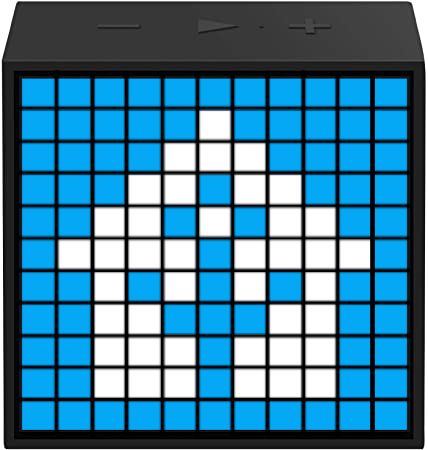
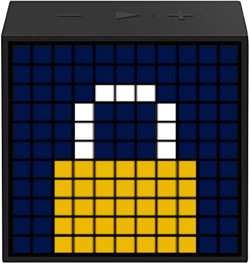
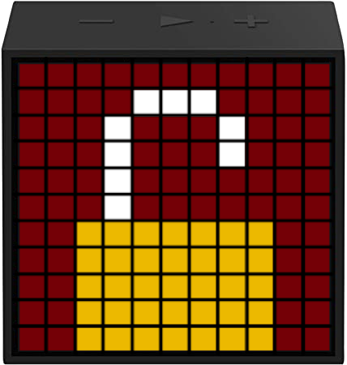
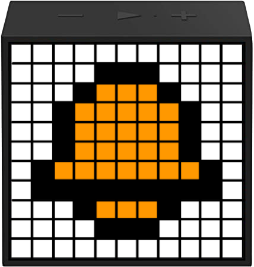
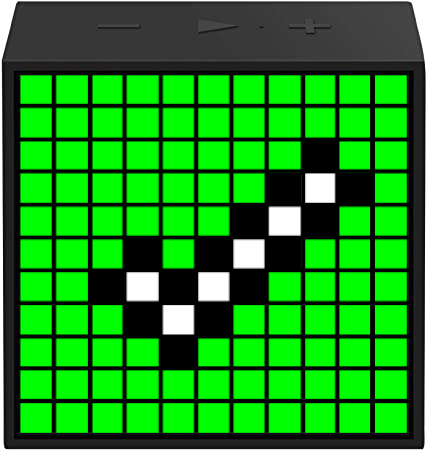
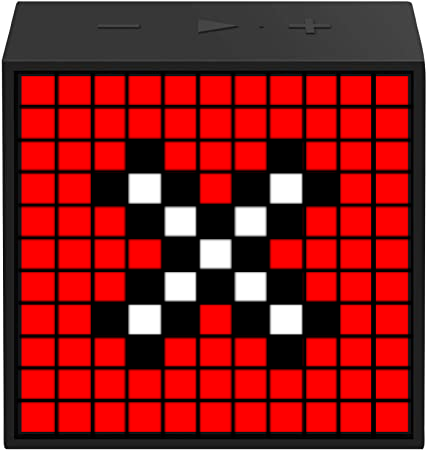
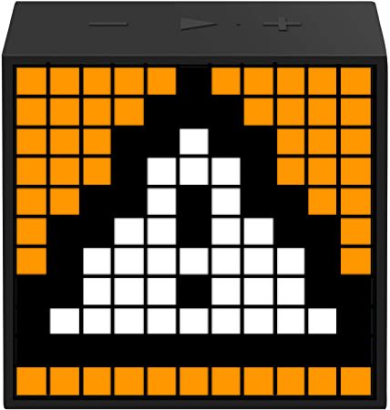
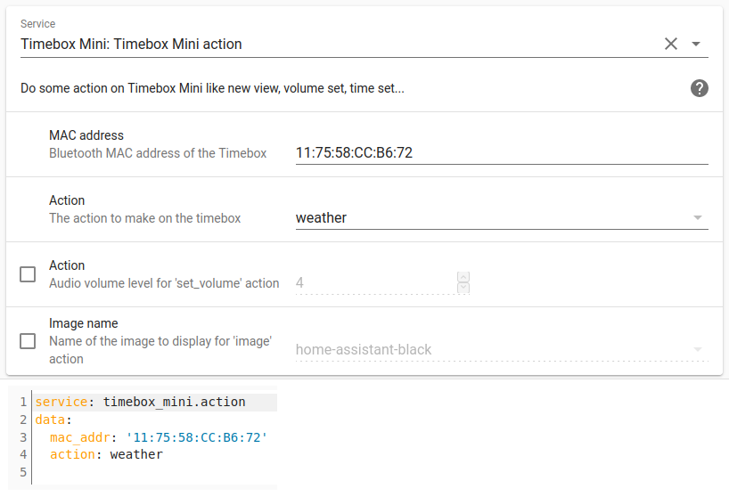
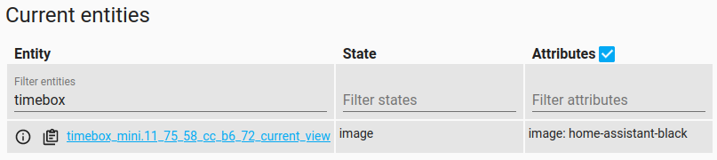

# homeassistant-timebox-mini
Divoom Timebox Mini custom service component for Home Assistant.
Based on [ScR4tCh/timebox](https://github.com/ScR4tCh/timebox) converted to Python3 and fixed.

### Table of content
* [Setup instructions](#setup-instructions)
  * [Copying into custom_components folder](#copying-into-custom_components-folder)
  * [Enabling the custom_component](#enabling-the-custom_component)
* [Troubleshooting](#troubleshooting)
* [Create your own picture / animation](#create-your-own-picture--animation)
  * [Picture](#picture)
  * [Animation](#animation)
* [TODO](#todo)
    
The Divoom Timebox Mini is a Bluetooth speaker with a 11x11 RGB LED matrix.


This component allow to run the following actions on your Timebox Mini from a HomeAssistant service:
- Set the clock automatically from your system clock
- Display the clock
- Set the audio volume level
- Set the LED brightness level
- Display the weather information (you have to use Divoom phone app to send weather info to your timebox)
- Display a picture/animation from predefined choices (see [matrices](timebox_mini/matrices) and [animations](timebox_mini/animations) folders) :



## Setup instructions
### Copying into custom_components folder
Create a directory `custom_components` in your Home-Assistant configuration directory.
Copy the whole [timebox_mini](timebox_mini) folder from this project into the newly created directory `custom_components`.

The result of your copy action(s) should yield a directory structure like so:

```
.homeassistant/
|-- custom_components/
|   |-- timebox_mini/
|       |-- matrices/*.png
|       |-- __init__.py
|       |-- manifest.json
|       |-- services.yaml
```

### Enabling the custom_component
In order to enable this custom device_tracker component, add this code snippet to your Home-Assistant `configuration.yaml` file:

```yaml
timebox_mini:
```
After restart, the `timebox_mini.action` service will be available. You only need the MAC address of your Timebox.


When you run an action that changes what is displayed on the Timebox, an entity will be created to save the current displayed state.



Please note that if you change the content on your Timebox without using the service (i.e. mobile app) this entity will not be updated.

## Troubleshooting
If the actions are not applied to your Timebox, you may need to pair manually with your device first using your OS Bluetooth settings.

## Create your own picture / animation
### Picture
You can create your own pixel-art matrix by using [PixilArt online tool](https://www.pixilart.com/draw).
- Start with a blank canvas of 11 x 11 
- Once finished, go to File > Donwload and download your .png

Copy the .png to the [matrices](timebox_mini/matrices) folder and add its name to [services.yaml](timebox_mini/services.yaml) in the `image` selector options. Restart HomeAssistant to take effect.

NOTE : the Timebox has a limited color set and cannot display all RGB shades, some color from your matrix will be approximated to the nearest one supported by Timebox.

### Animation
You can create a .gif for your animation using [EzGif Maker online tool](https://ezgif.com/maker). Start by loading all the matrices for your .gif that you have created previously (see above).

- Set the same delay for all frames. Timebox does not support different frame delays
- Check `use global colormap`
- Click `Make a gif!` then click `Save` icon on the far right

Copy the .gif to the [animations](timebox_mini/animations) folder and add its name to [services.yaml](timebox_mini/services.yaml) in the `animation` selector options. Restart HomeAssistant to take effect.

## TODO
- Weather info setting
- [Moving text](https://github.com/DaveDavenport/timebox/blob/master/examples/movingtext.py)
